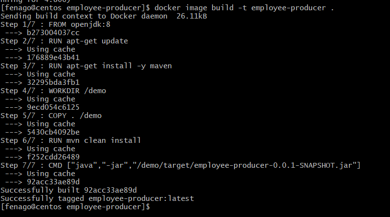
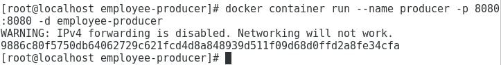
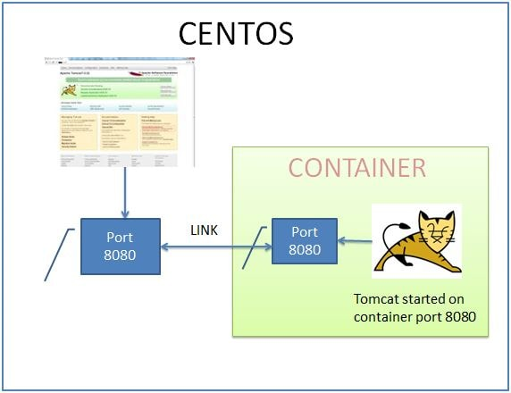
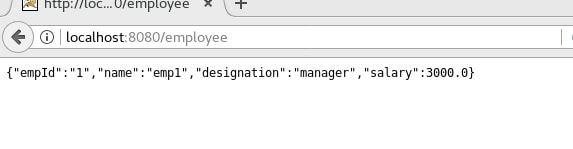

Lab: Deploying Spring Boot Microservice to Docker
=================================================


In this lab, we will cover the following:

-   Create a Spring Boot Web Application.
-   Create image for starting this application.
-   Run the above image as container to start the jar.


In this lab, we will deploy a simple Spring Boot Web Application named
employee-producer, that exposes a REST web service. We could retrieve
employee information in JSON format using this REST service. This was
developed to be deployed using JAR packaging. The project we will as
follows-


**Download Source Code**
Run the following command in the terminal to download source code:

```
git clone https://github.com/fenago/spring-boot-docker

cd spring-boot-docker/employee-producer
```

Run maven command - **mvn clean install**, and a jar file gets created in
the target folder (this will be done in Dockerfile).

**Dockerfile** Docker file is a list of commands that we want
the docker engine to execute. Go to the spring boot project folder and
create a docker file as follows-

```
FROM openjdk:8

RUN apt-get update
RUN apt-get install -y maven
WORKDIR /demo
COPY . /demo
RUN mvn clean install
CMD ["java","-jar","/demo/target/employee-producer-0.0.1-SNAPSHOT.jar"]
```


Now open the terminal and go to the Spring Boot project folder.
Next we will build an image with the name producer.

```
docker image build -t employee-producer .
```



Next we will run the above image as a container. Also we will be
publishing the docker port 8080 to centos port 8080.


This command is same as the previous examples only difference is we will
be using an additional command parameter name.
Until now we made use of the unique container id when we created a new
container. Instead now we can give an name to the container and use it
for referring the container.

```
docker container run --name producer -p 8080:8080 -d employee-producer
```





Here we have started the container with name as **producer**. Now using
the following command check the logs

```
docker container logs producer
```


The application has started successfully. Go to **http://springboot-docker.eastus.cloudapp.azure.com:8080/employee**, we will see that our application is deployed successfully.


