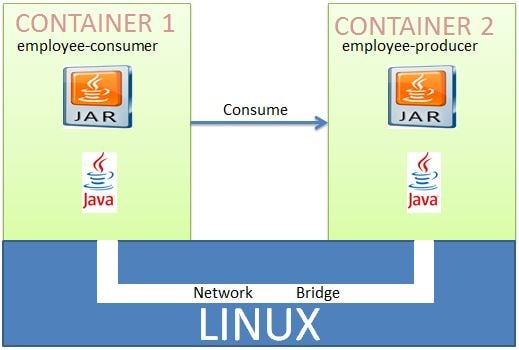

Lab: Deploying Multiple Spring Boot Microservices to Docker using Docker Networking
===================================================================================


In a previous docker lab, we
saw how to deploy a single Spring Boot Microservice to Docker Container.
But suppose the requirement is such that we may need to deploy multiple
microservices to Docker Container. For example we have the following
microservices that we have defined in previous tutorial,
As the name suggests employee-producer will be exposing REST APIs which
will be consumed by the employee-consumer.
The way Docker has been designed such that a Docker Container should
have only a single service running. Again we can have multiple services
running in docker using some workarounds but this will not be a good
design. So we will be deploying the two microservices employee-producer
and employee-consumer to two different containers and then have them
interact with each other.


In order to achieve this will have to make use of the **docker networking commands.**

**Lets Begin**

**Note:** Make sure to stop and delete all running container(s) first.

`docker stop $(docker ps -a -q) && docker rm $(docker ps -a -q)`

Lets begin with the implementation part.

-   **Employee Producer -**

Now open the terminal and go to the Spring Boot employee-producer
project folder.
Next we will build an image with the name producer.

```
cd ~/spring-boot-docker/employee-producer

docker image build -t employee-producer .
```


Next we will run the above image as a container named producer. Also we
will be publishing the docker port 8080 to centos port 8080.

```
docker container run --name producer -p 8080:8080 -d employee-producer
```


So our employee container has started. We can test this by going to
localhost:8080/employee, we will see that our application is deployed
successfully.


**Employee Consumer -**


We have created and started a container named **producer** where we have
deployed the employee-producer service.
So the only change we will be making is while consuming the employee
producer service we will be using this container named producer instead
of localhost:8080.
So in the ConsumerControllerClient class we will be having the base url
as **http://producer:8080/employee** instead of
http://localhost:8080/employee.

```
package com.javainuse.controllers;

import java.io.IOException;
import org.springframework.http.HttpEntity;
import org.springframework.http.HttpHeaders;
import org.springframework.http.HttpMethod;
import org.springframework.http.MediaType;
import org.springframework.http.ResponseEntity;
import org.springframework.web.client.RestClientException;
import org.springframework.web.client.RestTemplate;

public class ConsumerControllerClient {

    public void getEmployee() throws RestClientException, IOException {

        String baseUrl = "http://producer:8080/employee";
        RestTemplate restTemplate = new RestTemplate();
        ResponseEntity<String> response=null;
        try{
        response=restTemplate.exchange(baseUrl,
                HttpMethod.GET, getHeaders(),String.class);
        }catch (Exception ex)
        {
            System.out.println(ex);
        }
        System.out.println(response.getBody());
    }

    private static HttpEntity<?> getHeaders() throws IOException {
        HttpHeaders headers = new HttpHeaders();
        headers.set("Accept", MediaType.APPLICATION_JSON_VALUE);
        return new HttpEntity<>(headers);
    }
}
```

The docker file is as follows-

```
FROM openjdk:8

RUN apt-get update
RUN apt-get install -y maven
WORKDIR /demo
COPY . /demo
RUN mvn clean install
CMD ["java","-jar","/demo/target/employee-consumer-0.0.1-SNAPSHOT.jar"]
```


Open the terminal and go to the Spring Boot employee consumer project
folder.
Next we will build an image with the name consumer.

```
cd ~/spring-boot-docker/employee-consumer

docker image build -t employee-consumer .
```


Next we will run the above image as a container named consumer.

```
docker container run --name consumer -d employee-consumer
```


Next check the logs using

```
docker container logs consumer
```


Here we can see that the container named consumer is not able to
communicate with the container named producer.


So we are getting a null pointer exception.


**Inter Docker Container Communication Using Docker Networking**

We will be using Docker Networking to allow multiple containers to
interact with each other.



We will need to create our own network and add both the
employee-producer and employee-consumer services to it. We will stop and
remove the existing docker containers named consumer and producer.

**Note:** Make sure to stop and delete running container(s) first.


```
docker container stop producer

docker container rm producer
```


```
docker container stop consumer

docker container rm consumer
```

Lets first check the available networks

```
docker network ls
```


Next we will create our own network will be of type bridge

```
docker network create consumer-producer
```


Lets start the employee producer container on the newly created network.

```
docker container run --network consumer-producer --name producer -p 8080:8080 -d employee-producer
```


Lets start the employee consumer+ container on the newly created
network.

```
docker container run --network consumer-producer --name consumer -d employee-consumer
```


Lets check the consumer container logs-

```
docker container logs consumer -f
```


