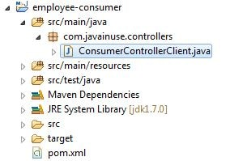

Lab: Microservice Registration and Discovery with Spring cloud
==============================================================

In this lab, we will develop 2 spring boot microservices named as
employee-producer and employee-consumer.
As the name suggests employee-producer will be exposing REST APIs which
will be consumed by the employee-consumer.


**Note:** Source code for both spring boot microservices is available here:
https://github.com/fenago/spring-boot-docker


Lets Begin
===========

-   Develop employee-producer as follows- The maven project we will be
    creating is as follows-
    
    

    The pom.xml with spring batch dependencies is as follows-

    ```
    <?xml version="1.0" encoding="UTF-8"?>
    <project xmlns="http://maven.apache.org/POM/4.0.0" xmlns:xsi="http://www.w3.org/2001/XMLSchema-instance"
        xsi:schemaLocation="http://maven.apache.org/POM/4.0.0 http://maven.apache.org/xsd/maven-4.0.0.xsd">
        <modelVersion>4.0.0</modelVersion>

        <groupId>com.javainuse</groupId>
        <artifactId>employee-producer</artifactId>
        <version>0.0.1-SNAPSHOT</version>
        <packaging>jar</packaging>

        <parent>
            <groupId>org.springframework.boot</groupId>
            <artifactId>spring-boot-starter-parent</artifactId>
            <version>1.4.1.RELEASE</version>
            <relativePath /> <!-- lookup parent from repository -->
        </parent>

        <properties>
            <project.build.sourceEncoding>UTF-8</project.build.sourceEncoding>
            <project.reporting.outputEncoding>UTF-8</project.reporting.outputEncoding>
            <java.version>1.8</java.version>
        </properties>

        <dependencies>
            <dependency>
                <groupId>org.springframework.boot</groupId>
                <artifactId>spring-boot-starter-web</artifactId>
            </dependency>


            <dependency>
                <groupId>org.springframework.boot</groupId>
                <artifactId>spring-boot-starter-test</artifactId>
                <scope>test</scope>
            </dependency>

        </dependencies>

        <build>
            <plugins>
                <plugin>
                    <groupId>org.springframework.boot</groupId>
                    <artifactId>spring-boot-maven-plugin</artifactId>
                </plugin>
            </plugins>
        </build>


    </project>
    ```

    
    


Define the domain class Employee

```
package com.javainuse.model;

public class Employee {
    private String empId;
    private String name;
    private String designation;
    private double salary;

    public Employee() {
    }

    public String getName() {
        return name;
    }

    public void setName(String name) {
        this.name = name;
    }

    public String getDesignation() {
        return designation;
    }

    public void setDesignation(String designation) {
        this.designation = designation;
    }

    public double getSalary() {
        return salary;
    }

    public void setSalary(double salary) {
        this.salary = salary;
    }

    public String getEmpId() {
        return empId;
    }

    public void setEmpId(String empId) {
        this.empId = empId;
    }

}
```

Expose the service using the Controller as:

```
package com.javainuse.controllers;

import org.springframework.web.bind.annotation.RequestMapping;
import org.springframework.web.bind.annotation.RequestMethod;
import org.springframework.web.bind.annotation.RestController;

import com.javainuse.model.Employee;

@RestController
public class TestController {

    @RequestMapping(value = "/employee", method = RequestMethod.GET)
    public Employee firstPage() {

        Employee emp = new Employee();
        emp.setName("emp1");
        emp.setDesignation("manager");
        emp.setEmpId("1");
        emp.setSalary(3000);

        return emp;
    }

}
```


Finally define the Spring Boot Main class:

```
package com.javainuse;

import org.springframework.boot.SpringApplication;
import org.springframework.boot.autoconfigure.SpringBootApplication;

@SpringBootApplication
public class SpringBootHelloWorldApplication {

    public static void main(String[] args) {
        SpringApplication.run(SpringBootHelloWorldApplication.class, args);
    }
}
```

Compile and the run the SpringBootHelloWorldApplication.java as a Java
application.
Go to **localhost:8080/employee**


Develop employee-consumer as follows- The maven project we will be
creating is as follows-




The pom.xml with spring batch dependencies is as follows-

```
<?xml version="1.0" encoding="UTF-8"?>
<project xmlns="http://maven.apache.org/POM/4.0.0" xmlns:xsi="http://www.w3.org/2001/XMLSchema-instance"
    xsi:schemaLocation="http://maven.apache.org/POM/4.0.0 http://maven.apache.org/xsd/maven-4.0.0.xsd">
    <modelVersion>4.0.0</modelVersion>

    <groupId>com.javainuse</groupId>
    <artifactId>employee-consumer</artifactId>
    <version>0.0.1-SNAPSHOT</version>
    <packaging>jar</packaging>

    <parent>
        <groupId>org.springframework.boot</groupId>
        <artifactId>spring-boot-starter-parent</artifactId>
        <version>1.4.1.RELEASE</version>
        <relativePath /> <!-- lookup parent from repository -->
    </parent>

    <properties>
        <project.build.sourceEncoding>UTF-8</project.build.sourceEncoding>
        <project.reporting.outputEncoding>UTF-8</project.reporting.outputEncoding>
        <java.version>1.8</java.version>
    </properties>

    <dependencies>
        <dependency>
            <groupId>org.springframework.boot</groupId>
            <artifactId>spring-boot-starter-web</artifactId>
        </dependency>


        <dependency>
            <groupId>org.springframework.boot</groupId>
            <artifactId>spring-boot-starter-test</artifactId>
            <scope>test</scope>
        </dependency>

    </dependencies>

    <build>
        <plugins>
            <plugin>
                <groupId>org.springframework.boot</groupId>
                <artifactId>spring-boot-maven-plugin</artifactId>
            </plugin>
        </plugins>
    </build>


</project>
```

Define the controller to consume the service exposed by
employee-producer above using the RESTTemplate as follows-

```
package com.javainuse.controllers;

import java.io.IOException;
import org.springframework.http.HttpEntity;
import org.springframework.http.HttpHeaders;
import org.springframework.http.HttpMethod;
import org.springframework.http.MediaType;
import org.springframework.http.ResponseEntity;
import org.springframework.web.client.RestClientException;
import org.springframework.web.client.RestTemplate;

public class ConsumerControllerClient {

    public void getEmployee() throws RestClientException, IOException {

        String baseUrl = "http://localhost:8080/employee";
        RestTemplate restTemplate = new RestTemplate();
        ResponseEntity<String> response=null;
        try{
        response=restTemplate.exchange(baseUrl,
                HttpMethod.GET, getHeaders(),String.class);
        }catch (Exception ex)
        {
            System.out.println(ex);
        }
        System.out.println(response.getBody());
    }

    private static HttpEntity<?> getHeaders() throws IOException {
        HttpHeaders headers = new HttpHeaders();
        headers.set("Accept", MediaType.APPLICATION_JSON_VALUE);
        return new HttpEntity<>(headers);
    }
}
```


Finally create the Bean for the above controller, load it and call the
getEmployee() Method.

```
package com.javainuse;

import java.io.IOException;

import org.springframework.boot.SpringApplication;
import org.springframework.boot.autoconfigure.SpringBootApplication;
import org.springframework.context.ApplicationContext;
import org.springframework.context.annotation.Bean;
import org.springframework.web.client.RestClientException;

import com.javainuse.controllers.ConsumerControllerClient;

@SpringBootApplication
public class SpringBootHelloWorldApplication {

    public static void main(String[] args) throws RestClientException, IOException {
        ApplicationContext ctx = SpringApplication.run(
                SpringBootHelloWorldApplication.class, args);
        
        ConsumerControllerClient consumerControllerClient=ctx.getBean(ConsumerControllerClient.class);
        System.out.println(consumerControllerClient);
        consumerControllerClient.getEmployee();
        
    }
    
    @Bean
    public  ConsumerControllerClient  consumerControllerClient()
    {
        return  new ConsumerControllerClient();
    }
}
```

Define the application.properties as

```
server.port=8091
```

Running the Rest Client we get the output as:


